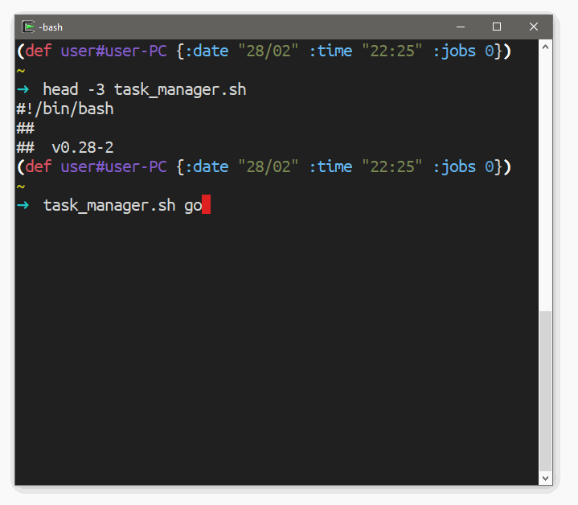

# `X` de Cada Dia

Projeto levemente inspirado na série **Aprenda X** mas com o objetivo de registrar os meus estudos "de cada dia" sobre algumas linguagens de programação que foram escolhidas por mim. Reunindo um vasto conteúdo de informações didaticamentes bem formuladas sobre cada linguagem e os conceitos que as cercam.

Para cada linguagem a ser conhecida, haverá um diretório (com o seu nome) que listará conteúdos que podem ser vídeos, artigos, playlists, livros, etc. Cada item (chamado de _tarefa_) foi escolhido com uma breve pesquisa sobre aspectos introdutórios da linguagem ou recomendado pela comunidade. Para mais informações sobre as tarefas dispostas e a formatação adotada, [clique aqui](#formatação).
Junto com o arquivo que listas as tarefas (**README.md** por padrão), haverá um [emblema/badge](https://shields.io) que servirá de "contador de progresso".

Além das tarefas em si, o [Projects](https://github.com/micalevisk/x-de-cada-dia/projects) deste repositório reunirá tanto ideia de projetos [pessoais] a serem desenvolvidos para praticar o uso das linguagens quanto links para informações mais "dinâmicas", como blogs.


## Formatação

O formato para listar as tarefas foi escolhido pensando nos scripts (em Shell Script) que controlariam a inserção, remoção e edição das tarefas.
Para o correto funcionamento desses scripts para "automatizar" a atualização das tarefas, o arquivo de texto **em Markdown** que lista as tarefas deve seguir o template <a href="http://ejs.co" title="Effective JavaScript templating">EJS</a> abaixo. Além disso, os itens (chamados de "tarefas") devem estar dipostos um por linha da seguinte forma:

```
<div align="center">
  " width="<%= lang.logo_width %>">
  <h1><i><%= lang.name %></i> de Cada Dia</h1>
  .svg" width="<%= lang.badge_width %>">
</div>

<p align="center">
<% sections.forEach(function(s) { -%>
  <a href="#<%= s.name.trim().toLowerCase().replace(/\\s/g, '-') %>">:<%= s.emoji %>:</a>&nbsp;
<% }) -%>
</p>

---

<div align="center">


<% sections.forEach(function(section) { -%>
## <%= section.name %>

status | title | last update | snnipet | notes
:-----:|:------|:-----------:|:-------:|:----:


<% }) -%>
</div>
```

```js
lang: {
  name: String,
  badge_color: String,
  badge_width: Number,
  logo_path: String,
  logo_width: Number,
};
sections: [{ name: String, emoji: String }];
```


### Sobre a tabela

Como visto anteriormente, a tabela de cada seção deve ter as seguintes colunas:

- `status`
  + Se não tiver valor, então a tarefa está pendente. Deve ser preenchido com o emoji de nome _white_check_mark_
- `title`*
  + Nome _único_ que identificará a tarefa
- `last update`
  + Indica que "versão" da tarefa foi registrar/feita
- `snippet`
  + Breve introdução sobre o conteúdo da tarefa
- `notes`
  + Referencia o arquivo/diretório que contém possíveis anotações sobre a tarefa, podendo ser código, pequeno projeto envolvido, etc


No arquivo, uma tarefa dita **pendente** deve estar mais ou menos assim:
> ```
> ^|| [nome-da-tarefa](link-para-a-tarefa) | data | |$
> ```

Ao passo que uma dita **concluída** deve estar assim:
> ```
> ^:white_check_mark: | [nome-da-tarefa](link-para-a-tarefa) | data | |$
> ```

## CLI Tool: Tasks Manager
> testado no `bash` (MinGW, Cygwin e Fish) e `zsh` (vide o script)

O script [tasks_manager.sh](./tasks_manager.sh) utiliza os padrões definidos para facilitar a criação, edição, remoção das tarefas.
Além de marcar as tarefas pendentes como _feitas_, abrir links do _title_ e criar arquivos e diretórios.
> `$ ./tasks_manager.sh` para maiores detalhes

[]()
